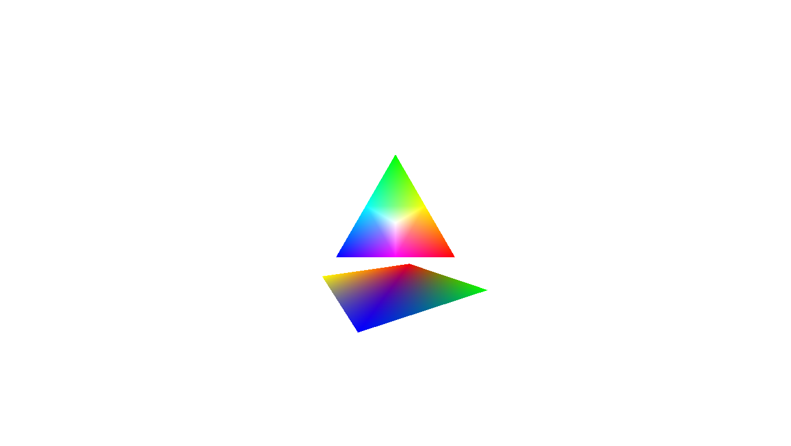

Example OpenGLES2 Android app for an Android phone and Android Things Rpi3 Device using Developer Preview 4.1, 5.1, 6.0
--------------------------------------------------------------------------------------

Just playing about trying to learn opengles2 using Android Things on the Raspberry Pi.  Any help or input
is much appreciated.  It's a very simple app to display (a simplified) Maxwell's colour triangle.

Please note this app comes in 4 flavours: phone, Android Things 41, Android Things 51 and Android Things 60

v1.1: The code is now running on Android Things DP60. I'd recommend you upgrade to Dev Preview 6.0.

as there are some ghosting issues using DP51 and some hdmi screens.

Android 41 is not hardware accelerated and therefore unlikey to work but I made it
for completeness.  The phone flavour does work and indicates the code is valid in a general sense and just 
 highlights the ghosting issue in DP51.  

Ty Harness December 2017

I've got my phone plugged into the USB and the debugging enabled.

To connect to Android Things:

adb connect 192.168.0.10

adb devices -l

List of devices attached

192.168.0.10:5555      device product:   iot_rpi3 model:iot_rpi3 device:rpi3

cfa60340               device usb:1-1

-------------------------------------------------------------------------------------
Download and install the Android SDK

---------------------------------------------------------------------------------------
Build via Android SDK the CLI:

./gradlew assembleDebug

------------------------------------------------------------------------
Installation and use:

Use your IP address and PhoneID not mine.

Please note if you only have one device connected then you can leave out:
-s name argument.

-----------------------------------------------------------------------
Android Phone Flavour:

Installation:

adb -s cfa60340 install -r app/build/outputs/apk/app-phone-debug.apk

Debugging:

adb -s cfa60340 logcat | grep MainActivity

-------------------------------------------------------------------
Android Things 60 Flavour:

adb -s 192.168.0.10 install -r app/build/outputs/apk/app-things60-debug.apk

adb -s 192.168.0.10 shell am start example.androidthings.myopengles2Test/.MainActivity

adb -s 192.168.0.10  logcat | grep MainActivity

-------------------------------------------------------------------
Android Things 51 Flavour:

same as above use:

app/build/outputs/apk/app-things60-debug.apk

--------------------------------------------------------------

Android Things 41 Flavour:

same as above use:

app/build/outputs/apk/app-things41-debug.apk

---------------------------------------------------------------
Useful Commands for Android Things:

Screen capture:

adb shell screencap /sdcard/at51.png

adb pull /sdcard/at51.png

adb shell screenrecord /sdcard/at51vid.mp4

adb pull /sdcard/at51vid.mp4

See what OEM apps have been installed:

adb -s 192.168.0.10 shell pm list packages -3
 

How to uninstall this app on Android Things:
adb -s 192.168.0.10 uninstall example.androidthings.myopengles2Test

